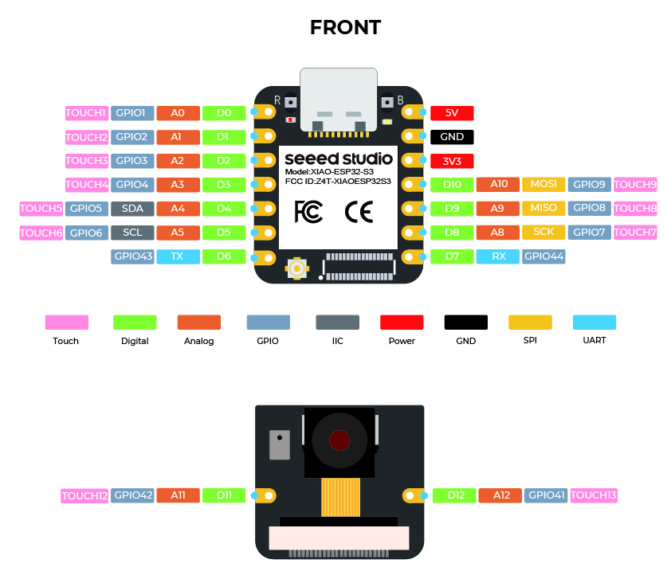

# Baltic Shoreline Monitor

## Project Goal
A low-power, solar-powered buoy uses vision and acoustic sensing to spot shoreline pollution such as oil films, abnormal noise or microplastic clusters. TinyML models running on an ESP32-S3 summarize the data and send compact events over a long‑range LoRa mesh.

## Hardware List
- **Seeed XIAO ESP32S3** with SX1262 LoRa radio
- **Solar panel + LiPo battery** for autonomous power
- **Grove Vision AI V2** camera module (I²C)
- **Hydrophone + preamp** for underwater audio
- **Air530 GPS** (UART)
- **SSD1315 OLED** display (I²C)
- **MicroSD card** for local logging

## Hardware Wiring Diagram

*Sensors and peripherals wired to the Seeed XIAO ESP32-S3.*

## Build and Flash Steps
The root-level `platformio.ini` targets the Seeed XIAO ESP32S3. Build and deploy the application firmware with PlatformIO:

1. Install PlatformIO: `pip install platformio`
2. From the repository root run `pio run -e seeed_xiao_esp32s3`
3. Connect the board over USB and flash: `pio run -e seeed_xiao_esp32s3 -t upload`
4. (Optional) open a serial console: `pio device monitor -b 115200`

## Building the Host Integration Test
The integration test in `tests/integration_test.cpp` can be compiled and run on a
desktop machine. The original instructions used `/tmp/integration_test` as the
output binary, which works on Unix-like systems but fails on Windows because the
`/tmp` directory is not defined. Use a repository-local build directory instead:

1. Create an output directory (run once):
   - macOS/Linux: `mkdir -p build`
   - Windows (PowerShell or Command Prompt): `mkdir build`
2. Compile the test (single translation unit build):
   - macOS/Linux: `g++ -std=c++17 tests/integration_test.cpp -Isrc -o build/integration_test`
   - Windows (PowerShell or Command Prompt): ``g++ -std=c++17 tests\integration_test.cpp -Isrc -o build\integration_test.exe``
3. Run the resulting executable from the `build` directory.

The integration test automatically includes the necessary firmware sources when
compiled on its own. If you prefer to compile each firmware source file
separately, define `FIRMWARE_HOST_SEPARATE_OBJECTS=1`, keep the `-Isrc` include
path, and pass the individual `.cpp` files explicitly (as in previous revisions).

## Detailed Guides
- [ESP32-S3 Comprehensive Guide](./ESP32-S3_Comprehensive_Guide.md)
- [Hardware Component Validation Guide](./docs/hardware_component_tests.md)
- [Meshtastic firmware README](./meshtastic-firmware-2.6.11.60ec05e/README.md)
- [Meshtastic documentation](https://meshtastic.org/docs/)
- [FreeRTOS API reference](https://freertos.org)

## Firmware Architecture
The firmware runs on top of Arduino's FreeRTOS scheduler. A `SystemController` singleton wires up queues, mutexes, and high-level drivers before the application tasks launch:

- **AudioFrontend** – configures the ADC/PDM front-end and streams hydrophone audio frames for on-device feature extraction.
- **VisionModule** – owns the Grove Vision AI V2 I²C session, gating access with the shared bus mutex and producing detection events.
- **GPSReceiver** – manages the Air530 UART link, parsing NMEA sentences into geo-tagged telemetry packets.
- **MeshLink** – packages event payloads into Meshtastic `PRIVATE_APP` mesh packets via the Router interface so transmissions stay protocol-compatible with upstream firmware.
- **StorageLogger** – encapsulates SD card rotation, daily file creation and diagnostic summaries for transmissions and audio snapshots.

FreeRTOS tasks (`Task_SenseAudio`, `Task_Vision`, `Task_GPS`, `Task_Uplink`, `Task_Logger`) each delegate their inner loop to share
d processing helpers. The helpers are reused by host-side tests so behaviour can be validated without a RTOS scheduler. Communicat
ion between subsystems flows through strongly typed queues declared in `SystemContext`.

docs/assets/architecture.jpg
