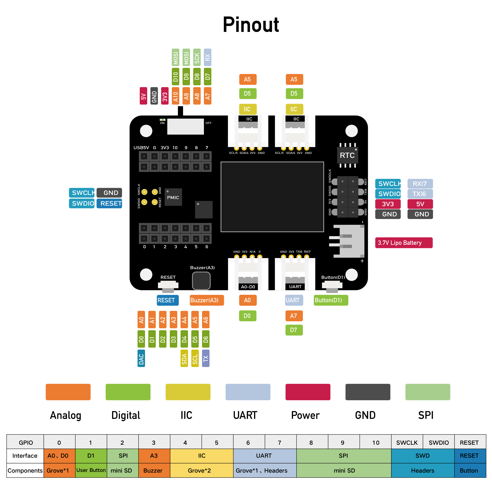
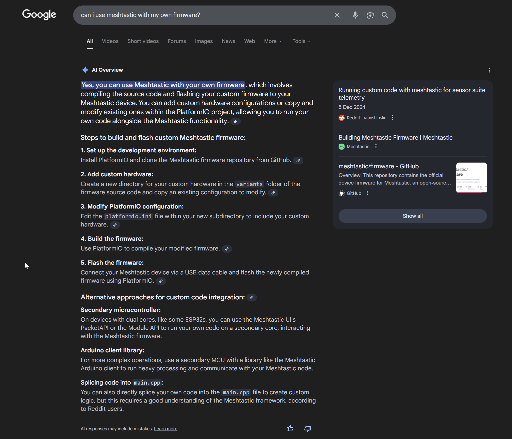

Baltic Shoreline Pollution Monitor

What problem are you going to solve?
Marine ecosystems, especially near coastlines, are increasingly polluted by microplastics, oil residue, and chemical waste. These pollutants often go undetected until visible damage appears, making early detection vital. Current monitoring solutions are either expensive, manually labor-intensive, or incapable of detecting low-intensity or tightly localized pollution events.

What are you going to build to solve this problem? How is it different from existing solutions? Why is it useful?
I will build a low-power, solar-powered floating device that uses vision (camera) and acoustic (hydrophone) sensing to detect signs of shoreline pollution, such as surface oil films, unusual noise patterns, or microplastic clusters. The data will be processed using lightweight AI models (TinyML) deployed on an ESP32. A Meshtastic LoRa mesh network will allow these buoys to communicate over long distances.

What makes this project unique is its combination of edge processing, ultra-low power operation, and completely untethered deployment. It is low-cost and easily replicable, ideal for forming swarms of sensing buoys to cover entire coastal areas. Future versions can evolve into autonomous patrol vessels, offering mobile pollution detection and live data transmission.

How does your solution work? What are the main features? Please specify how you will use the NextPCB $500 Manufacturing Voucher in your solution.
The device will include:
- A camera to detect visual pollution (e.g., oil film, foam, macro debris)
- A hydrophone + preamp to detect acoustic anomalies caused by marine traffic or irregular underwater events. Also to listen to animal sounds like whales for example.
- A GPS module to geotag pollution readings and monitor drift
- A solar panel and Li-Ion battery to enable autonomous, untethered operation
- LoRa (Meshtastic) for wireless communication in a mesh network
- Optional TinyML-based object detection or sound classification models trained on real-world Baltic data
The NextPCB voucher will be used to manufacture the waterproof PCB that integrates the ESP32, charging circuit, preamp, LoRa module, and sensor inputs. Two units will be fabricated for validation and deployment.

*High-level wiring diagram connecting sensors, power, and radio modules.*

List the hardware and software you will use to build this.
- MCU: Xiao ESP32-S3
- CAM: Grove - Vision AI module V2 Himax WiseEye2 HX6538
- INA332 preamp for Hydrophone
- GPS: Grove - GPS module (Air530)
- Wio-SX1262 (for Meshtastic Network communication)
- Solar panel (5V, 6W) + battery
- 3D-printed or custom waterproof buoy housing
- Custom PCB with environmental sealing (via NextPCB)
- Edge Impulse or TensorFlow Lite – visual/audio TinyML
- Meshtastic firmware (LoRa)
- Custom C++ firmware (ESP-IDF or Arduino)

*Early prototype of the buoy hardware.*

Which Track are you participating in?
1. Idea to Prototype

Do you have an existing Hackster project? Paste URL here.
No

You agree to the terms and conditions of the voucher: The $500 coupon is applicable for purchasing 2 PCBA prototypes. The coupon can be used toward PCB fabrication, components, PCBA assembly, and shipping costs. Any costs exceeding $500 will be the responsibility of the applicant. Applicants are responsible for any customs duties or import fees. NextPCB does not cover these charges. The coupon is valid for one-time use only and cannot be combined with other promotions. If additional PCBA units are needed, applicants may cover the remaining cost.
Agree

What other social media profiles you use to promote your own portfolio/work?
https://diegogalue.tech/ https://github.com/dgalue

Did you register for "On the Edge" giveaway to make sure your application here is accounted for points towards the Omni AI Campaign?
Yes

*Meshtastic phone app discovering nearby LoRa nodes.*
